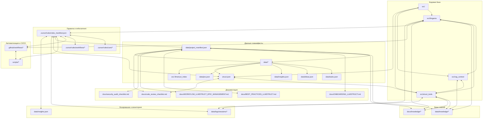

# Аудит llmgenie (2025-06-12)

## Итоговые файлы
- **project_map.md** — карта и структура проекта
- **cleanup_roadmap.md** — дорожная карта по улучшениям
- **audit_checklist.md** — мастер-чеклист аудита

Вся вспомогательная и промежуточная информация: `workfiles/`

---

## Визуализация структуры проекта

### Mermaid-диаграмма (вся архитектура llmgenie)

> Диаграмма выше отражает основные связи между кодом, данными, знаниями, документацией, правилами, автоматизацией и логированием в проекте llmgenie.

### PNG-диаграмма структуры проекта

---

## Структура итоговых файлов аудита (PNG)

 