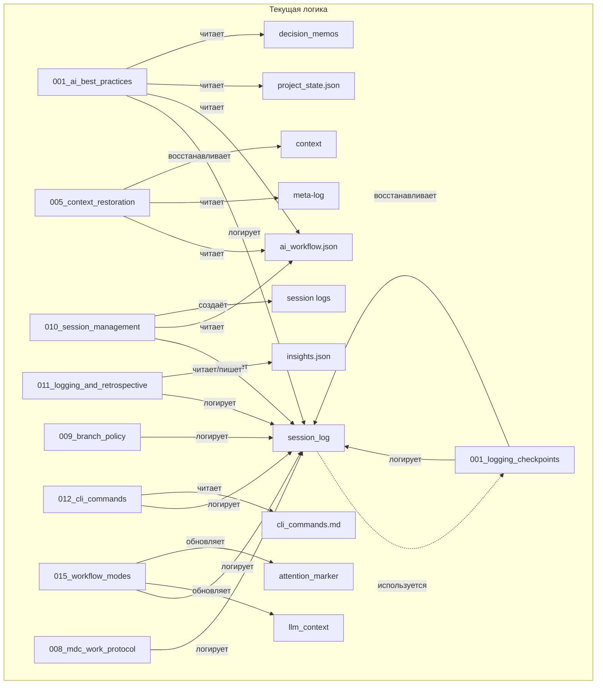

# Внутренняя логика и взаимодействие core-правил llmstruct

## 1. Общая схема взаимодействий (текущая и планируемая)

### Текущая логика


### Планируемая логика
```mermaid
flowchart TD
    subgraph Planned[Планируемая логика]
        AA1[001_ai_best_practices] -->|логирует| BB1[session_log]
        AA1 -->|читает| CC1[ai_workflow.json]
        AA1 -->|читает| DD1[project_state.json]
        AA1 -->|читает| EE1[decision_memos]
        BB1 -.->|используется| FF1[001_logging_checkpoints]
        FF1 -->|логирует| BB1
        FF1 -->|восстанавливает| BB1
        GG1[005_context_restoration] -->|читает| CC1
        GG1 -->|читает| meta-log
        GG1 -->|восстанавливает| context
        HH1[010_session_management] -->|логирует| BB1
        HH1 -->|читает| CC1
        HH1 -->|создаёт| SS1[session logs]
        II1[011_logging_and_retrospective] -->|логирует| BB1
        II1 -->|читает/пишет| insights.json
        JJ1[009_branch_policy] -->|логирует| BB1
        KK1[012_cli_commands] -->|логирует| BB1
        KK1 -->|читает| cli_commands.md
        LL1[015_workflow_modes] -->|логирует| BB1
        LL1 -->|обновляет| llm_context
        LL1 -->|обновляет| attention_marker
        MM1[008_mdc_work_protocol] -->|логирует| BB1
        %% Новое: автоматические вызовы по @
        LL1 -->|@-ссылка| JJ1
        LL1 -->|@-ссылка| HH1
        LL1 -->|@-ссылка| II1
        LL1 -->|@-ссылка| MM1
        %% Валидация связей
        LL1 -->|валидирует| ALLR[all_rules]
        ALLR -.->|граф зависимостей| LL1
    end
```

---

## 2. Подробная логика по каждому core-правилу

### 001_ai_best_practices
- **Логирует:** session_log, event_log/meta-log
- **Читает:** ai_workflow.json, project_state.json, decision_memos
- **@-ссылки:** @data/ai_workflow.json, @data/logs/sessions/session_<current>.jsonl, @project_state.json, @docs/decision_memos/
- **Взаимодействует с:** 001_logging_checkpoints, 005_context_restoration, 010_session_management, 011_logging_and_retrospective, 009_branch_policy, 012_cli_commands, 015_workflow_modes, 008_mdc_work_protocol

### 001_logging_checkpoints
- **Логирует:** session_log, event_log/meta-log
- **Восстанавливает:** context из session_log
- **@-ссылки:** нет
- **Взаимодействует с:** 001_ai_best_practices, 005_context_restoration

### 005_context_restoration
- **Читает:** ai_workflow.json, meta-log
- **Восстанавливает:** context
- **@-ссылки:** нет
- **Взаимодействует с:** 001_logging_checkpoints

### 010_session_management
- **Логирует:** session_log
- **Читает:** ai_workflow.json
- **Создаёт:** session logs
- **@-ссылки:** @ai_workflow.json, @session_log
- **Взаимодействует с:** 001_ai_best_practices, 011_logging_and_retrospective

### 011_logging_and_retrospective
- **Логирует:** session_log
- **Читает/пишет:** insights.json
- **@-ссылки:** @session_log, @insights.json
- **Взаимодействует с:** 010_session_management

### 009_branch_policy
- **Логирует:** session_log, event_log/meta-log
- **@-ссылки:** @session_log, @workflow_enforcement
- **Взаимодействует с:** 015_workflow_modes

### 012_cli_commands
- **Логирует:** session_log
- **Читает:** cli_commands.md
- **@-ссылки:** @session_log, @docs/cli_commands.md
- **Взаимодействует с:** 010_session_management

### 015_workflow_modes
- **Логирует:** session_log
- **Обновляет:** llm_context, attention_marker
- **@-ссылки:** @session_log, @llm_context, @attention_marker
- **Взаимодействует с:** 009_branch_policy, 010_session_management, 011_logging_and_retrospective, 008_mdc_work_protocol

### 008_mdc_work_protocol
- **Логирует:** session_log
- **@-ссылки:** нет
- **Взаимодействует с:** 015_workflow_modes

---

## 3. Принципы планируемой архитектуры
- Все @-ссылки становятся автоматическими вызовами.
- Строится граф зависимостей между правилами.
- AI/утилита может автоматически вызывать связанные правила по @.
- Возможна автоматическая маршрутизация и валидация связей.
- Все взаимодействия явно описаны в frontmatter (role, modes, tags, links). 