# Граф связей между atomic-правилами, логами и документацией

## Mermaid-граф связей (по @-ссылкам и Meta)

```mermaid
graph TD
    %% Примеры связей между core-правилами и внешними объектами
    A1[001_ai_best_practices] -- @data/ai_workflow.json --> J1[ai_workflow.json]
    A1 -- @data/logs/sessions/session_<current>.jsonl --> L1[session_log]
    A1 -- @project_state.json --> P1[project_state.json]
    A1 -- @docs/decision_memos/ --> D1[decision_memos]
    A1 -- @session_log --> L1
    A1 -- @docs/BEST_PRACTICES_LLMSTRUCT.md --> B1[best_practices_doc]
    A1 -- @docs/ONBOARDING_LLMSTRUCT.md --> O1[onboarding_doc]
    A1 -- @workflow_enforcement --> W1[workflow_enforcement]
    A1 -- @llm_context --> C1[llm_context]
    A1 -- @attention_marker --> M1[attention_marker]
    A1 -- @insights.json --> I1[insights.json]
    A1 -- @rules_manifest.json --> R1[rules_manifest.json]
    %% Примеры связей между другими правилами
    B2[010_session_management] -- @session_log --> L1
    B2 -- @ai_workflow.json --> J1
    B2 -- @insights.json --> I1
    C2[011_logging_and_retrospective] -- @session_log --> L1
    C2 -- @insights.json --> I1
    D2[009_branch_policy] -- @session_log --> L1
    D2 -- @workflow_enforcement --> W1
    E2[012_cli_commands] -- @session_log --> L1
    E2 -- @docs/cli_commands.md --> CMD1[cli_commands_doc]
    F2[015_workflow_modes] -- @session_log --> L1
    F2 -- @llm_context --> C1
    F2 -- @attention_marker --> M1
    G2[008_mdc_work_protocol] -- @session_log --> L1
    %% Примеры связей с ролями и ревью
    R1R[roles/210_reviewer] -- @session_log --> L1
    R1R -- @docs/code_review_checklist.md --> CRC1[code_review_checklist]
    R1R -- @docs/BEST_PRACTICES_LLMSTRUCT.md --> B1
    R1R -- @session_log --> L1
    R2K[roles/200_knowledge_engineer] -- @session_log --> L1
    R2K -- @docs/ONBOARDING_LLMSTRUCT.md --> O1
    R2K -- @docs/BEST_PRACTICES_LLMSTRUCT.md --> B1
    R2K -- @session_log --> L1
    R3E[roles/220_rules_engineer] -- @session_log --> L1
    R3E -- @rules_manifest.json --> R1
    R3E -- @docs/decision_memos/ --> D1
    %% Примеры связей с workflows, security, templates
    WF1[workflows/100_code_review] -- @session_log --> L1
    WF1 -- @docs/code_review_checklist.md --> CRC1
    SEC1[security/400_audit] -- @session_log --> L1
    SEC1 -- @docs/security_audit_checklist.md --> SA1[security_audit_checklist]
    TMP1[templates/900_template_commit] -- @session_log --> L1
    TMP1 -- @docs/commit_message_template.md --> CMT1[commit_message_template]
```

---

## План по atomic-линтеру/валидатору

1. **Цели:**
   - Проверять корректность frontmatter (description, globs, alwaysApply).
   - Проверять наличие и валидность секции Meta (role, applies to, links).
   - Валидировать все @-ссылки: существуют ли целевые объекты/файлы/правила.
   - Проверять, что все atomic-правила покрывают свою зону ответственности и не дублируют друг друга.
   - Проверять, что все роли и режимы обсуждений покрыты хотя бы одним atomic-правилом.
   - Генерировать граф связей (Mermaid/Graphviz) для визуализации и аудита.
2. **Архитектура:**
   - CLI-утилита на Python или bash (или встроить в CI).
   - Использовать парсинг YAML/frontmatter и Markdown.
   - Для @-ссылок — проверка существования файлов/правил/доков.
   - Для atomic-структуры — анализ coverage по ролям/режимам/функциям.
3. **Результат:**
   - Отчет о найденных ошибках, дублировании, пропущенных ролях/режимах, невалидных ссылках.
   - Автоматическая генерация Mermaid-графа связей.
   - Возможность интеграции в CI/CD pipeline. 