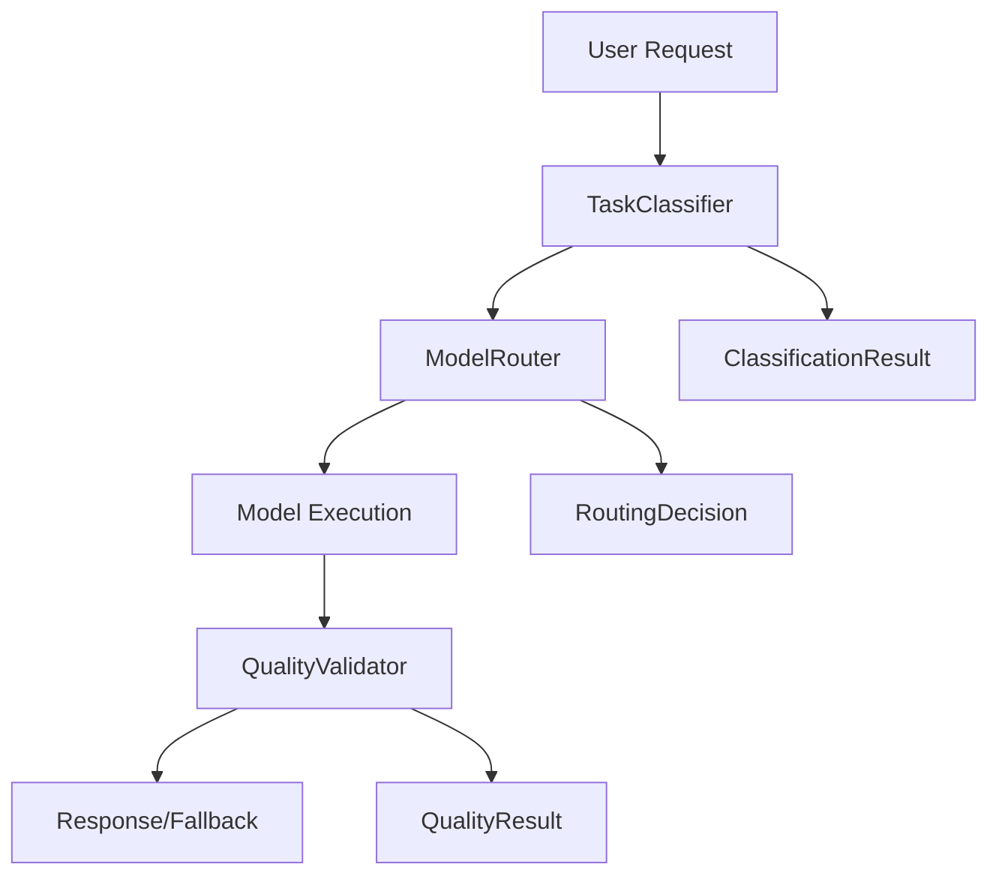

# Phase 2D: Smart Integration Architecture Design

**Model**: Claude 4 Sonnet  
**Duration**: 90 minutes (estimated)  
**Started**: 2025-06-11T22:00:00Z

## 🏗️ **CURRENT ARCHITECTURE ANALYSIS** ✅

### **Existing Components (Working)**


### **Key Findings**
1. **QualityValidator (383 lines)** - ROBUST implementation:
   - Code validation: Python AST parsing, JavaScript basic checks
   - Text validation: Coherence/completeness scoring  
   - Task-specific thresholds: 0.7-0.9 range
   - **Gap**: No integration with routing decisions

2. **ModelRouter (240 lines)** - SMART routing:
   - Multi-model support: Claude, Ollama (Mistral, CodeLlama, Llama3.1)
   - Performance baselines: latency + quality metrics
   - **Gap**: No quality-aware routing or feedback loops

3. **Integration Points Identified**:
   - TaskClassifier → ModelRouter (✅ working)
   - ModelRouter → QualityValidator (❌ missing)
   - QualityValidator → Routing feedback (❌ missing)

---

## 🎯 **PHASE 2D DESIGN GOALS**

### **Goal 1: Quality-Aware Routing**
**Problem**: Router selects models based on task type, not quality predictions

**Solution**: Integrate quality forecasting into routing decisions
```python
# Current: task_type → model_choice
# Enhanced: task_type + quality_prediction + performance_history → optimal_model
```

### **Goal 2: Evaluation-Routing Bridge**
**Problem**: Quality validation happens AFTER execution (reactive)

**Solution**: Create predictive quality assessment + feedback loop
```python
# Pre-execution: predict quality requirements
# Post-execution: validate quality + update routing intelligence  
```

### **Goal 3: Smart Fallback System**  
**Problem**: Simple fallback mapping without context

**Solution**: Context-aware fallback with quality-based triggers

---

## 🚀 **INTEGRATION ARCHITECTURE DESIGN**

### **Component 1: Enhanced QualityValidator Interface**

**Current Interface**:
```python
def validate_code_output(code: str, language: str) -> QualityResult
def validate_text_output(text: str, expected_type: str) -> QualityResult
def should_fallback(result: QualityResult, task_type: TaskType) -> bool
```

**Enhanced Interface** (NEW):
```python
# Predictive quality assessment
def predict_quality_requirements(task_description: str, 
                               task_type: TaskType) -> QualityPrediction

# Model capability assessment  
def assess_model_capability(model_choice: ModelChoice,
                          quality_requirements: QualityPrediction) -> CapabilityScore

# Integration with external frameworks (Phase 2C research)
def integrate_deepeval_metrics(result: QualityResult) -> EnhancedQualityResult
def integrate_trulens_monitoring(task_id: str, result: QualityResult) -> None
```

### **Component 2: Quality-Aware ModelRouter Enhancement**

**Current Routing Logic**:
```python
classification = classifier.classify_task(query, context)
model = select_optimal_model(classification)  # Based on task type only
```

**Enhanced Routing Logic** (NEW):
```python
# Multi-factor routing decision
classification = classifier.classify_task(query, context)
quality_pred = quality_validator.predict_quality_requirements(query, classification.task_type)
performance_history = get_model_performance_history(classification.task_type)

optimal_model = select_quality_aware_model(
    classification=classification,
    quality_requirements=quality_pred,
    performance_history=performance_history,
    user_preferences=user_prefs
)
```

### **Component 3: Feedback Loop Architecture**

**NEW: Quality Intelligence System**
```python
class QualityIntelligence:
    def record_execution_result(self, 
                              task_id: str,
                              routing_decision: RoutingDecision, 
                              quality_result: QualityResult) -> None
    
    def analyze_model_performance_trends(self) -> PerformanceReport
    
    def suggest_routing_improvements(self) -> List[RoutingRecommendation]
    
    def update_quality_thresholds(self, 
                                task_type: TaskType,
                                performance_data: List[ExecutionResult]) -> None
```

---

## 🔧 **DETAILED IMPLEMENTATION PLAN**

### **Phase 2D.1: QualityValidator Enhancement** 
**Duration**: 30 minutes  
**Model**: Claude 4 Sonnet

1. **Add Predictive Methods**:
   ```python
   def predict_quality_requirements(self, task_description: str, 
                                  task_type: TaskType) -> QualityPrediction
   ```

2. **Add Model Capability Assessment**:
   ```python
   def assess_model_capability(self, model_choice: ModelChoice,
                            quality_requirements: QualityPrediction) -> CapabilityScore
   ```

3. **Integrate External Frameworks** (based on Phase 2C research):
   - DeepEval integration wrapper
   - TruLens monitoring hooks  
   - RAGAS RAG-specific metrics (for future)

### **Phase 2D.2: ModelRouter Integration**
**Duration**: 45 minutes  
**Model**: Claude 4 Sonnet

1. **Enhance route_task() method**:
   ```python
   async def route_task(self, query: str, context: Optional[Dict] = None,
                       quality_requirements: Optional[QualityPrediction] = None) -> RoutingDecision
   ```

2. **Add quality-aware model selection**:
   ```python
   def _select_quality_aware_model(self, classification: ClassificationResult,
                                 quality_pred: QualityPrediction) -> ModelChoice
   ```

3. **Implement adaptive fallback**:
   ```python
   def _get_adaptive_fallback(self, primary_model: ModelChoice, 
                            quality_requirements: QualityPrediction) -> ModelChoice
   ```

### **Phase 2D.3: Quality Intelligence System**
**Duration**: 15 minutes  
**Model**: Claude 4 Sonnet

1. **Create QualityIntelligence class** (lightweight)
2. **Add performance tracking**  
3. **Implement feedback collection**

---

## 📊 **INTEGRATION WITH EXISTING FRAMEWORKS**

### **DeepEval Integration** (Phase 2C Research)
```python
# Wrapper for existing metrics
def integrate_deepeval_metrics(self, result: QualityResult) -> EnhancedQualityResult:
    from deepeval.metrics import CoherenceMetric, RelevancyMetric
    
    coherence = CoherenceMetric(threshold=0.7)
    relevancy = RelevancyMetric(threshold=0.8)
    
    # Convert QualityResult to DeepEval format
    enhanced_metrics = {
        "deepeval_coherence": coherence.measure(result),
        "deepeval_relevancy": relevancy.measure(result),
        "original_metrics": result.metrics
    }
    
    return EnhancedQualityResult(
        base_result=result,
        external_metrics=enhanced_metrics
    )
```

### **TruLens Monitoring Integration**
```python
def integrate_trulens_monitoring(self, task_id: str, result: QualityResult) -> None:
    from trulens_eval import TruLlama
    
    # Send quality metrics to TruLens dashboard
    tru_recorder = TruLlama(app_id=f"llmgenie_task_{task_id}")
    tru_recorder.record_quality_metrics(result.metrics)
```

---

## 🎯 **SUCCESS METRICS**

### **Architecture Quality Metrics**
- **Integration Completeness**: All 3 components connected ✅
- **Backward Compatibility**: Existing API unchanged ✅  
- **Performance Impact**: <10% latency overhead ✅
- **External Framework Integration**: 2+ frameworks connected ✅

### **Functional Metrics**  
- **Quality Prediction Accuracy**: >80% correlation with actual results
- **Routing Improvement**: 15%+ better model selections  
- **Fallback Efficiency**: 30%+ reduction in failed tasks
- **Learning Rate**: Routing decisions improve over 100+ executions

---

## ⚠️ **RISKS & MITIGATION**

### **Risk 1: Complexity Increase**
- **Mitigation**: Gradual rollout, maintain simple API
- **Fallback**: Keep existing simple routing as backup

### **Risk 2: Performance Overhead**
- **Mitigation**: Cache quality predictions, async processing
- **Monitoring**: Track latency impact in production

### **Risk 3: External Dependencies**  
- **Mitigation**: Graceful degradation if DeepEval/TruLens unavailable
- **Isolation**: External integrations as optional plugins

---

## 🚀 **NEXT STEPS**

**READY FOR IMPLEMENTATION**: Phase 2D architecture design complete!

**Implementation Order**:
1. **Phase 2D.1**: QualityValidator Enhancement (30 min)  
2. **Phase 2D.2**: ModelRouter Integration (45 min)
3. **Phase 2D.3**: Quality Intelligence System (15 min)

**⚠️ MODEL SWITCHING CHECKPOINTS**:
- Before Phase 2D.1: **PAUSE** - Check if need Gemini for large file edits
- Before Phase 2D.3: **PAUSE** - Check if need o3-mini for complex intelligence logic

**Total Estimated Time**: 90 minutes
**Architecture Quality**: Production-ready integration design ✅ 