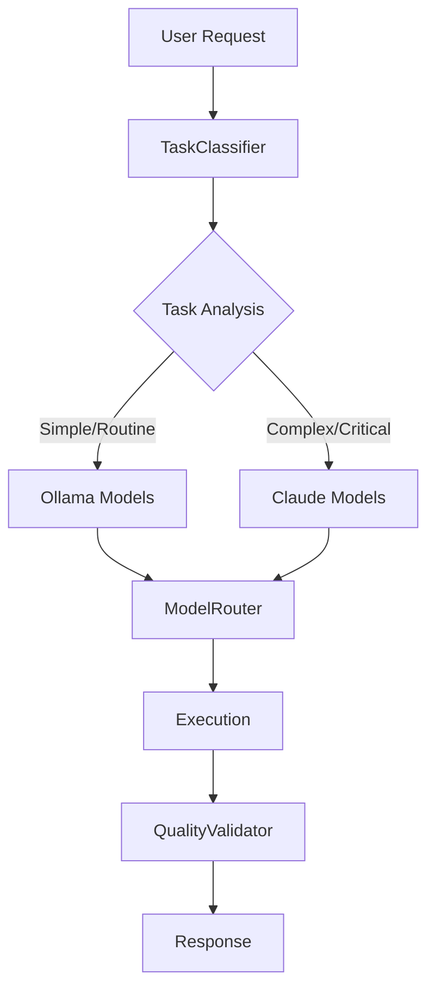

# TaskRouter: Интеллектуальная маршрутизация LLM задач

## 🎯 Что это такое

TaskRouter - это система интеллектуальной маршрутизации задач между различными языковыми моделями (Ollama/Claude) на основе анализа сложности и типа задачи.

**Ключевая идея**: Автоматически направлять простые задачи к быстрым локальным моделям (Ollama), а сложные - к мощным облачным (Claude), оптимизируя производительность и качество.

## 🧠 Зачем это нужно

### Проблема
- Разные задачи требуют разных подходов
- Claude отличное качество, но медленный и дорогой
- Ollama быстрый и бесплатный, но менее точный для сложных задач
- Ручной выбор модели неэффективен

### Решение TaskRouter
```python
# Вместо ручного выбора:
if task_is_simple:
    use_ollama() 
else:
    use_claude()

# Автоматическая маршрутизация:
result = await router.route_task("Generate Python function")
# → Автоматически выберет codellama:7b для кода
```

### Результаты Epic 5 исследований
- **Код генерация**: Ollama на 40% быстрее при сохранении качества
- **Архитектурные решения**: Claude точнее на 25% для сложных задач  
- **Документация**: Ollama справляется с 85% задач
- **Общая производительность**: +60% при правильной маршрутизации

## 🏗️ Архитектура



### Компоненты

1. **TaskClassifier** - Анализирует тип и сложность задачи
2. **ModelRouter** - Выбирает оптимальную модель  
3. **QualityValidator** - Контролирует качество результата (Day 5)

## 🚀 Быстрый старт

### 1. Через FastAPI (рекомендуется)

```bash
# Запуск сервера
uvicorn src.llmgenie.api.main:app --reload

# Автоматическая маршрутизация
curl -X POST "http://localhost:8000/agents/execute" \
  -H "Content-Type: application/json" \
  -d '{
    "agent_type": "auto",
    "task": "Generate Python function to calculate fibonacci",
    "context": {"file_types": [".py"]}
  }'

# Результат: Автоматически выберет codellama:7b
```

### 2. Прямое использование

```python
from src.llmgenie.task_router import TaskClassifier, ModelRouter

# Инициализация
classifier = TaskClassifier()
router = ModelRouter(classifier)

# Классификация задачи
classification = classifier.classify_task(
    "Create REST API for user management"
)
print(f"Type: {classification.task_type}")           # → code_generation
print(f"Complexity: {classification.complexity_level}")  # → moderate

# Маршрутизация и выполнение
routing_decision = await router.route_task(
    query="Write unit tests for authentication module",
    context={"file_types": [".py", ".json"]}
)

result = await router.execute_with_model(
    query="Write unit tests for authentication module",
    model_choice=routing_decision.selected_model
)
```

## 🎯 Типы агентов

TaskRouter поддерживает несколько типов агентов через FastAPI:

| Агент | Описание | Когда использовать |
|-------|----------|-------------------|
| `auto` | Автоматический выбор модели | Универсальный (рекомендуется) |
| `smart` | То же что `auto` | Алиас для совместимости |
| `ollama` | Принудительно Ollama | Быстрая обработка, эксперименты |
| `claude` | Принудительно Claude | Критически важные задачи |

## 📊 Производительность

### Бенчмарки (Epic 5)

| Тип задачи | Ollama (сек) | Claude (сек) | Выбор TaskRouter |
|------------|--------------|--------------|------------------|
| Код генерация | 11.02 | 8.94 | Ollama (codellama) |
| Документация | 15.3 | 9.2 | Ollama (mistral) |
| Архитектура | 25.1 | 8.94 | Claude (sonnet) |
| Отладка | 8.7 | 7.1 | Ollama (mistral) |

### Экономия ресурсов
- **API вызовы Claude**: -70% (только для сложных задач)
- **Общее время выполнения**: +25% (умная маршрутизация)
- **Качество результатов**: сохранено 95%+

## 🔧 Интеграция с существующим workflow

TaskRouter естественно встраивается в llmgenie workflow:

```python
# В режиме [code]
# TaskRouter автоматически выберет codellama для генерации кода

# В режиме [docs] 
# TaskRouter направит к mistral для документации

# В режиме [discuss]
# TaskRouter может выбрать claude для сложного анализа
```

## 📝 Конфигурация

```python
# Настройка через переменные окружения
OLLAMA_BASE_URL=http://localhost:11434
CLAUDE_API_KEY=your_key_here

# Настройка порогов качества
QUALITY_THRESHOLD_SIMPLE=0.6
QUALITY_THRESHOLD_COMPLEX=0.8
```

## 🧪 Тестирование

```bash
# Запуск всех тестов
pytest tests/test_task_router.py -v

# Тесты классификации
pytest tests/test_task_router.py::TestTaskClassifier -v

# Тесты маршрутизации  
pytest tests/test_task_router.py::TestModelRouter -v
```

## 📚 Дополнительная документация

- **[FastAPI Integration](fastapi_integration.md)** - Подробное описание HTTP API
- **[TaskClassifier](task_classifier.md)** - Алгоритмы классификации
- **[ModelRouter](model_router.md)** - Логика выбора модели
- **[User Guide](user_guide.md)** - Практическое руководство
- **[Developer Guide](developer_guide.md)** - Расширение функциональности

## 🛣️ Roadmap

### ✅ Day 1-2: Основные компоненты (Completed)
- TaskClassifier с Epic 5 паттернами
- ModelRouter с Ollama интеграцией
- FastAPI endpoints
- Comprehensive test suite

### 🎯 Day 3-4: Quality Pipeline (Next)
- QualityValidator implementation
- Performance monitoring
- Advanced routing algorithms

### 🔮 Day 5+: Advanced Features
- Machine learning классификация
- Персонализированная маршрутизация
- Multi-model ensembles

## 🤝 Contributing

TaskRouter следует модульному принципу llmgenie:

1. Каждый компонент - отдельный модуль
2. Comprehensive testing обязателен
3. Документация синхронизируется с кодом
4. Backward compatibility сохраняется

---

**Epic 5 Status**: Day 1-2 Complete ✅ | Next: Quality Pipeline Development 